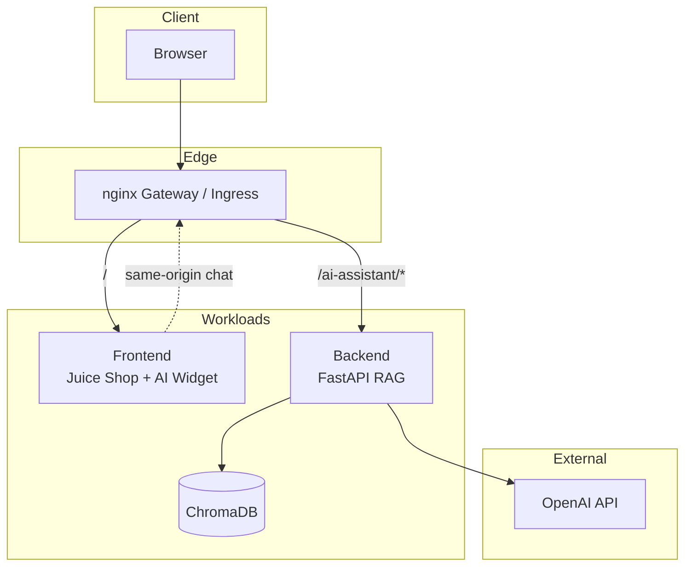
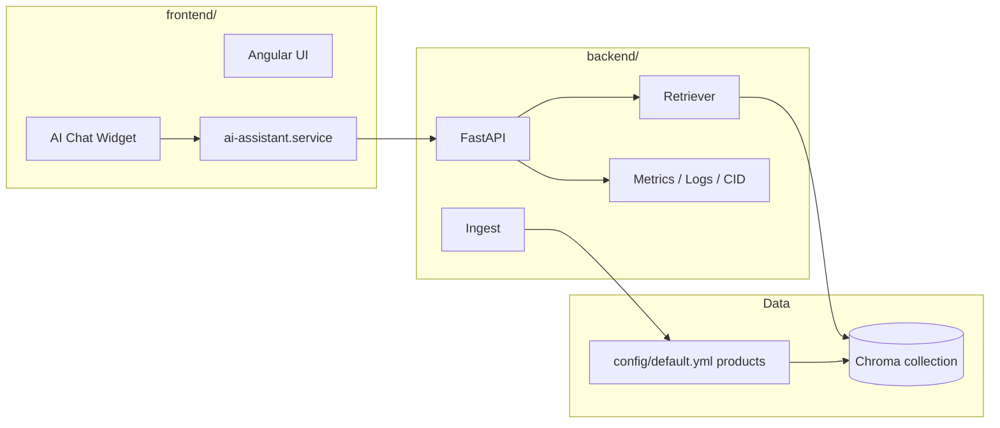
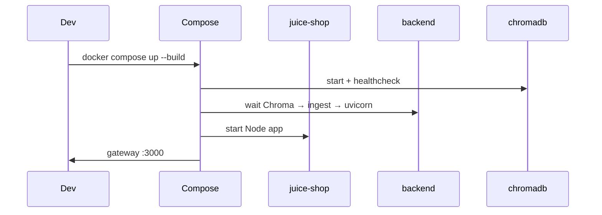
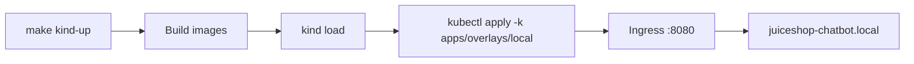
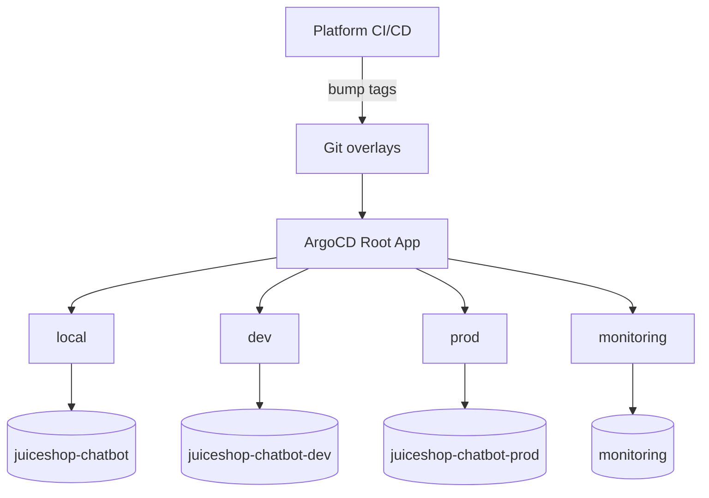
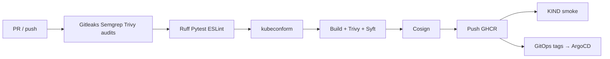

# Juice Shop AI Platform

Cloud-native RAG assistant for [OWASP Juice Shop](https://owasp-juice.shop): FastAPI + OpenAI + ChromaDB, Angular chat widget, Docker Compose, KIND, Helm, GitOps (ArgoCD), and GitHub Actions CI/CD.

> Upstream Juice Shop docs remain in [`README.md`](./README.md). This document covers the **AI platform** stack only.  
> Full task checklist: [`DELIVERABLES.md`](./DELIVERABLES.md).

## Table of contents

- [Architecture](#architecture)
- [Component diagram](#component-diagram)
- [Repository layout](#repository-layout)
- [Prerequisites](#prerequisites)
- [Docker Compose](#docker-compose)
- [KIND](#kind)
- [Helm](#helm)
- [GitOps (ArgoCD)](#gitops-argocd)
- [CI/CD](#cicd)
- [Local development](#local-development)
- [Observability](#observability)
- [Security](#security)
- [Troubleshooting](#troubleshooting)
- [Future improvements](#future-improvements)
- [Related docs](#related-docs)

---

## Architecture

Full diagram set (overall, Kubernetes, CI/CD, GitOps, RAG): [docs/architecture.md](./docs/architecture.md).



**Request path:** browser → ingress/gateway → Juice Shop UI; chat calls `/ai-assistant/*` → FastAPI retrieves product embeddings from ChromaDB and generates answers via OpenAI.

---

## Component diagram



| Component | Path | Role |
|-----------|------|------|
| Frontend | `frontend/` | Juice Shop + chat widget |
| Backend | `backend/` | FastAPI RAG API |
| ChromaDB | `chromadb/` | Vector store image |
| Gateway | `deploy/` | nginx same-origin proxy (Compose) |
| GitOps | `apps/`, `argocd/` | Kustomize + ArgoCD |
| Helm | `helm/` | Packaged install |
| CI | `.github/workflows/platform-ci.yml` | Full CI/CD + DevSecOps + GitOps |

---

## Repository layout

```text
frontend/   backend/   chromadb/   deploy/
apps/       helm/      k8s/        argocd/
.github/workflows/     scripts/    docs/
Makefile    docker-compose.yml     kind-config.yaml
```

Details: [docs/repository-structure.md](./docs/repository-structure.md)

---

## Prerequisites

- Docker (Desktop or Colima)
- Node.js 24+ (frontend/local Juice Shop)
- Python 3.11+ (backend local)
- `kubectl`, `kind`, `helm`, `make` (Kubernetes path)
- OpenAI API key in `.env.openai`:

```bash
OPEN_AI_KEY=sk-...
```

---

## Docker Compose

```bash
# From repo root
cp backend/.env.example .env.openai   # if needed; set OPEN_AI_KEY
docker compose up --build
```

| Service | URL |
|---------|-----|
| Gateway (UI + AI) | http://localhost:3000 |
| Backend direct | http://localhost:8000 |
| ChromaDB | http://localhost:8001 |

Chat uses same-origin `/ai-assistant/` via the gateway.



---

## KIND

```bash
make kind-up          # cluster + ingress-nginx
make deploy           # build/load images + apply apps/overlays/local
# /etc/hosts: 127.0.0.1 juiceshop-chatbot.local
open http://juiceshop-chatbot.local:8080
```

Useful targets: `make status`, `make logs`, `make port-forward`, `make delete`, `make delete-all`.

Full guide: [docs/kind-deployment.md](./docs/kind-deployment.md)



Create the OpenAI secret before first deploy if not handled by `scripts/deploy.sh`:

```bash
kubectl -n juiceshop-chatbot create secret generic juiceshop-chatbot-secrets \
  --from-literal=OPEN_AI_KEY="sk-..." \
  --dry-run=client -o yaml | kubectl apply -f -
```

---

## Helm

```bash
make kind-up && make build-images && make load-images
kubectl -n juiceshop-chatbot create secret generic juiceshop-chatbot-secrets \
  --from-literal=OPEN_AI_KEY="sk-..." --dry-run=client -o yaml | kubectl apply -f -
make helm-install
```

Values: `helm/values.yaml` (defaults), `values-local.yaml` (KIND), `values-dev.yaml` (dev).

Do **not** mix Helm and raw Kustomize in the same namespace (different resource names).

Guide: [docs/helm.md](./docs/helm.md)

---

## GitOps (ArgoCD App of Apps)



| Overlay | Namespace | Purpose |
|---------|-----------|---------|
| `apps/overlays/local` | `juiceshop-chatbot` | KIND (`*:local`, hostPath PV) |
| `apps/overlays/dev` | `juiceshop-chatbot-dev` | GHCR SHA tags |
| `apps/overlays/prod` | `juiceshop-chatbot-prod` | Pinned versions |
| `apps/overlays/ci` | `juiceshop-chatbot` | Ephemeral CI KIND |

Bootstrap: [docs/gitops.md](./docs/gitops.md) · `make argocd-apply`

---

## CI/CD + DevSecOps

Workflow: [`.github/workflows/platform-ci.yml`](./.github/workflows/platform-ci.yml)



Tags: `latest`, short SHA, `dev` (develop), semver on `main` / `v*`.

Guides: [docs/ci-cd.md](./docs/ci-cd.md) · [docs/devsecops.md](./docs/devsecops.md) · [docs/deployment.md](./docs/deployment.md)

---

## Local development

### Backend

```bash
cd backend
python3.11 -m venv .venv && source .venv/bin/activate
pip install -r requirements.txt -r requirements-dev.txt
export OPEN_AI_KEY=sk-...
export PRODUCTS_CONFIG_PATH=../config/default.yml
export CHROMA_HOST=127.0.0.1 CHROMA_PORT=8001
# start Chroma via compose: docker compose up chromadb -d
uvicorn main:app --reload --port 8000
```

CI parity: `make ci-lint` · `make ci-test`

### Frontend widget

```bash
cd frontend && npm install
# point environment to http://localhost:8000 for direct API, or use gateway
```

Production build uses `aiAssistantUrl: '/ai-assistant'` (same-origin).

---

## Observability

| Endpoint | Purpose |
|----------|---------|
| `GET /livez` | Liveness |
| `GET /readyz` | Readiness (Chroma) |
| `GET /health` | Aggregate + correlation id |
| `GET /metrics` | Prometheus |

Structured JSON logs + `X-Correlation-ID` / `X-Request-ID`. Grafana: `monitoring/grafana-ai-assistant-dashboard.json`.

Details: [docs/observability.md](./docs/observability.md)

---

## Security

- Secrets out-of-band (`juiceshop-chatbot-secrets`)
- Non-root, drop ALL caps, RO root FS (backend/frontend), seccomp RuntimeDefault
- Dedicated ServiceAccounts + least-privilege RBAC
- NetworkPolicies (default deny; CI overlay disables for smoke tests)

Details: [docs/security.md](./docs/security.md)

---

## Troubleshooting

| Symptom | Check |
|---------|--------|
| Chat 502 / RAG failed | `OPEN_AI_KEY` secret; backend logs; OpenAI quota |
| `/readyz` 503 | ChromaDB pod/PVC; `CHROMA_HOST` |
| Ingress 404 | Host header `juiceshop-chatbot.local`; port **8080** on KIND |
| Images not found in KIND | `make build-images && make load-images` |
| Helm vs Kustomize conflicts | Use one installer per namespace |
| NetworkPolicy blocks traffic | Confirm `ingress-nginx` namespace; CI overlay strips policies |
| Empty product answers | Re-ingest: `POST /ingest?reset=true` or set `INGEST_ON_STARTUP=true` |
| Frontend can't reach AI | Prod URL must be `/ai-assistant` behind gateway/ingress |

```bash
make status
make logs-backend
kubectl -n juiceshop-chatbot get networkpolicy,sa,secret
curl -fsS http://127.0.0.1:8000/livez
curl -fsS http://127.0.0.1:8000/metrics | head
```

---

## Future improvements

- External Secrets Operator / Sealed Secrets for GitOps
- Horizontal Pod Autoscaler + PDB for backend
- Distributed tracing (OpenTelemetry) end-to-end
- Multi-arch images (`linux/arm64`)
- Canary / progressive delivery (Argo Rollouts)
- Broader e2e coverage for the chat widget in Cypress
- Optional local LLM path (no OpenAI) for air-gapped demos

---

## Related docs

| Doc | Topic |
|-----|-------|
| [docs/architecture.md](./docs/architecture.md) | Mermaid diagrams (overall, K8s, CI, GitOps, RAG) |
| [docs/validation.md](./docs/validation.md) | Post-deploy validation script |
| [docs/kind-deployment.md](./docs/kind-deployment.md) | KIND |
| [docs/helm.md](./docs/helm.md) | Helm |
| [docs/gitops.md](./docs/gitops.md) | ArgoCD / Kustomize |
| [docs/ci-cd.md](./docs/ci-cd.md) | GitHub Actions |
| [docs/observability.md](./docs/observability.md) | Metrics / logs |
| [docs/security.md](./docs/security.md) | Hardening |
| [docs/repository-structure.md](./docs/repository-structure.md) | Layout |

---

**License:** same as OWASP Juice Shop (MIT). AI platform additions follow the repository license.
