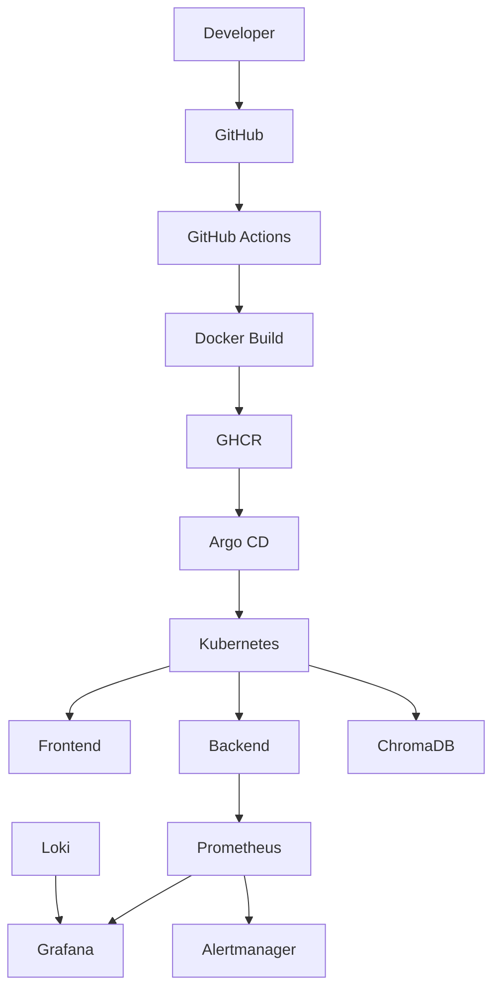
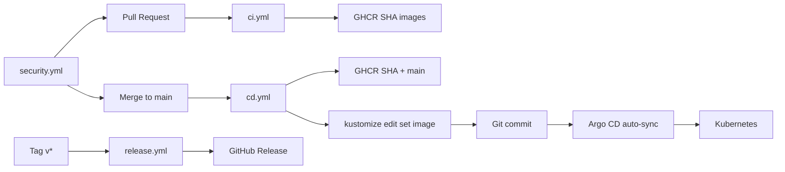

# OWASP Juice Shop Chatbot

**Cloud Native AI Platform** — RAG chatbot for [OWASP Juice Shop](https://owasp-juice.shop), delivered with Kubernetes, GitOps, CI/CD, DevSecOps, and full observability.

Built as a **portfolio-quality** Platform / SRE demo: production-inspired patterns, optimized for **local KIND on Apple Silicon**.

**Repository:** [github.com/amaninsa/owasp-juiceshop-chatbot](https://github.com/amaninsa/owasp-juiceshop-chatbot)

[](LICENSE)
[](https://github.com/amaninsa/owasp-juiceshop-chatbot/actions/workflows/ci.yml)
[](https://github.com/amaninsa/owasp-juiceshop-chatbot/actions/workflows/cd.yml)
[](https://github.com/amaninsa/owasp-juiceshop-chatbot/actions/workflows/security.yml)
[](https://github.com/amaninsa/owasp-juiceshop-chatbot/actions/workflows/release.yml)
[](kind-config.yaml)
[](docker-compose.yml)
[](argocd/)
[](k8s/monitoring/)
[](k8s/monitoring/)
[](k8s/monitoring/)
[](backend/)

---

## Project overview

This repository extends OWASP Juice Shop with an **AI shopping assistant**:

- Users ask natural-language questions about products and prices.
- A **FastAPI** backend performs **RAG** (retrieve from **ChromaDB**, generate with **OpenAI**).
- The same repo packages the app for **Docker**, **Kubernetes (KIND)**, **Helm**, and **Argo CD**.
- **GitHub Actions** enterprise CI/CD: PR quality gates → GHCR → Kustomize bump → **Argo CD only** (no `kubectl apply` from CI).
- **Prometheus / Grafana / Loki / Alertmanager** provide metrics, dashboards, logs, and alerts.

It is intentionally **not** a multi-AZ HA production cluster. It is a **local, interview-ready platform** that demonstrates how a Platform Engineer would wire these pieces together.

---

## Achievements

| Area | Delivered |
|------|-----------|
| Kubernetes | Manifests, NetworkPolicies, RBAC, Ingress, KIND |
| GitOps | Argo CD App of Apps, auto-sync, prune, self-heal |
| CI/CD | GitHub Actions (`ci` / `cd` / `security` / `release`) → GHCR → Argo CD |
| DevSecOps | Gitleaks, Trivy, CodeQL, Dependency Review |
| AI / RAG | FastAPI + ChromaDB + OpenAI embeddings/chat |
| Monitoring | Prometheus + Alertmanager + kube-state-metrics + node-exporter |
| Logging | Loki + Promtail |
| Observability | Grafana dashboards + Explore (metrics + logs) |
| Containers | Multi-stage Dockerfiles, Compose, GHCR |
| Local DX | Makefile, `make doctor` / `demo` / `urls`, local monitoring profile |

---

## Architecture



Full diagrams (PNG-exportable Mermaid): [`docs/architecture.md`](./docs/architecture.md) · [`docs/diagrams/`](./docs/diagrams/)

---

## Features

- AI chat widget embedded in Juice Shop (Angular)
- FastAPI RAG API (`/chat`, `/ingest`, `/metrics`, health probes)
- OpenAI embeddings + chat completions
- ChromaDB vector store of Juice Shop products
- Docker Compose for laptop iteration
- Kubernetes + Kustomize overlays (`local` / `dev` / `prod` / `ci`)
- Helm chart (alternate packaging)
- KIND single-node cluster tuned for Apple Silicon
- Argo CD App of Apps (`make argocd-install` → `make argocd-apply`)
- GitHub Actions Platform CI/CD with DevSecOps gates
- Observability stack with **local** (emptyDir, 24h) and **production** (PVC) profiles
- Backend Prometheus metrics + structured JSON logs
- NetworkPolicies, non-root security contexts, RBAC

---

## Tech stack

| Layer | Technology |
|-------|------------|
| Frontend | Angular (OWASP Juice Shop) + AI widget |
| Backend | Python 3.11, FastAPI, Pydantic |
| AI | OpenAI embeddings + GPT |
| Vector DB | ChromaDB |
| Edge | ingress-nginx (KIND :8080) |
| Orchestration | Docker Compose, Kubernetes, Helm, KIND |
| GitOps | Argo CD + Kustomize |
| CI/CD | GitHub Actions → GHCR + Cosign |
| DevSecOps | Gitleaks, Semgrep, Trivy, Syft, pip-audit |
| Observability | Prometheus, Grafana, Loki, Promtail, Alertmanager |

---

## Folder structure

```text
frontend/                 Juice Shop UI + AI chat widget
backend/                  FastAPI RAG assistant
chromadb/                 ChromaDB container image
deploy/                   Optional nginx gateway (Compose)
apps/                     GitOps base + overlays (local/dev/prod/ci)
helm/                     Helm chart
k8s/                      Raw manifests + monitoring overlays
k8s/monitoring/           base / local / production observability
argocd/                   App-of-Apps bootstrap + local patches
.github/workflows/        platform-ci.yml (+ supporting workflows)
scripts/                  kind-up, deploy, doctor, demo, urls, …
docs/                     Architecture, demo, GitOps, monitoring, …
Makefile                  Local orchestration
docker-compose.yml
kind-config.yaml
```

Docs hub: [`docs/README.md`](./docs/README.md)

---

## Prerequisites

- Docker Desktop or Colima (**Apple Silicon:** ≥ 8 GiB RAM, ≥ 40–60 GiB disk recommended)
- `kubectl`, `kind`, `make` (and `helm` if using the chart)
- OpenAI API key

```bash
cp .env.example .env.openai
# OPEN_AI_KEY=sk-...
```

---

## Deployment

### 1) Docker Compose (fastest app-only loop)

```bash
docker compose up --build
```

| URL | Service |
|-----|---------|
| http://localhost:3000 | Gateway / UI |
| http://localhost:8000 | Backend |
| http://localhost:8001 | ChromaDB |

### 2) KIND (full platform demo)

```bash
make doctor
make kind-up
make deploy
make monitoring
make argocd-install && make argocd-apply
make urls
make demo
```

Add `/etc/hosts` entries printed by `make urls`.  
App: http://juiceshop-chatbot.local:8080

### 3) Helm (alternate)

```bash
make kind-up && make build-images && make load-images
make helm-install
```

Do **not** mix Helm and Kustomize in the same namespace.

---

## Monitoring

| Profile | Command | Notes |
|---------|---------|-------|
| Local (default) | `make monitoring` | emptyDir, 24h retention, **cAdvisor disabled** |
| Production-style | `make monitoring-production` | PVC, longer retention, cAdvisor on |

| UI | URL |
|----|-----|
| Grafana | http://grafana.juiceshop-chatbot.local:8080 |
| Prometheus | http://prometheus.juiceshop-chatbot.local:8080 |
| Alertmanager | http://alertmanager.juiceshop-chatbot.local:8080 |

Details: [`docs/monitoring.md`](./docs/monitoring.md)

**Expected local usage:** ~6–10 GiB RAM for app + monitoring + Argo CD; keep ≥ 5–8 GiB free on the KIND node.

---

## GitOps

```bash
make argocd-install    # CRDs + server + local resource caps
make argocd-apply      # AppProject + App of Apps
make argocd-status
```

UI: http://argocd.juiceshop-chatbot.local:8080  

Details: [`docs/argocd.md`](./docs/argocd.md) · [`docs/gitops.md`](./docs/gitops.md)

---

## CI/CD

Enterprise GitOps pipeline (no `kubectl apply` from Actions):



| Workflow | Trigger | Purpose |
|----------|---------|---------|
| [`ci.yml`](./.github/workflows/ci.yml) | Pull request | Black, isort, Ruff, mypy, pytest · npm lint/build · build/push GHCR |
| [`cd.yml`](./.github/workflows/cd.yml) | Push to `main` | Rebuild/push → `kustomize edit set image` on `apps/overlays/local` → commit → **Argo CD** |
| [`security.yml`](./.github/workflows/security.yml) | PR / push / weekly | Gitleaks, Trivy FS/config, Dependency Review, CodeQL |
| [`release.yml`](./.github/workflows/release.yml) | Tag `v*` | Release notes, images, GitHub Release |

**Image tags**

```text
ghcr.io/amaninsa/frontend:<git-sha>
ghcr.io/amaninsa/backend:<git-sha>
ghcr.io/amaninsa/chromadb:<git-sha>
```

**Deployment flow:** Git push → GitHub Actions → GHCR → Kustomize update → Git commit → Argo CD sync → Kubernetes.

Details: [`docs/github-actions.md`](./docs/github-actions.md) · [`docs/cicd.md`](./docs/cicd.md)

---

## DevSecOps

| Gate | Workflow | Policy |
|------|----------|--------|
| Gitleaks | `security.yml` | Fail on secrets |
| Trivy FS / config | `security.yml` | Fail CRITICAL/HIGH |
| Trivy image | `ci.yml` / `cd.yml` / `release.yml` | Fail CRITICAL/HIGH before push |
| Dependency Review | `security.yml` (PR) | Fail on high |
| CodeQL | `security.yml` | JS/TS + Python |
| Permissions | all workflows | `contents` / `packages` / `id-token` / `security-events` via `GITHUB_TOKEN` |

Details: [`docs/devsecops.md`](./docs/devsecops.md)

---

## Screenshots

Capture guide for LinkedIn: [`docs/screenshots.md`](./docs/screenshots.md)

Suggested order: AI Chat → Pods → Architecture → Prometheus → Grafana → Loki → Argo CD → GitHub Actions.

---

## Demo flow

```bash
make doctor && make urls && make demo
```

10-minute guide: [`docs/demo.md`](./docs/demo.md)  
Spoken script: [`docs/demo-script.md`](./docs/demo-script.md)

1. Show GitHub repo + badges  
2. Show Kubernetes pods / ingress  
3. Ask the AI a product question (RAG)  
4. Prometheus targets + PromQL  
5. Grafana dashboards  
6. Loki logs  
7. Alertmanager  
8. Argo CD App of Apps  
9. GitHub Actions green run  

---

## Troubleshooting

| Issue | Fix |
|-------|-----|
| Docker / KIND unhealthy | `make doctor` |
| DiskPressure / crashing monitoring | `make clean` then `make monitoring` |
| Ingress 404 | Hosts file + port **8080** |
| Chat 502 | `OPEN_AI_KEY` / secret `juiceshop-chatbot-secrets` |
| Image pull | `make build-images && make load-images` |

More: [`docs/troubleshooting.md`](./docs/troubleshooting.md)

```bash
make status
make logs-backend
make validate
```

---

## Future improvements

- External Secrets / Sealed Secrets  
- HPA + PodDisruptionBudgets  
- OpenTelemetry tracing  
- Multi-arch (`linux/arm64`) image matrix  
- Argo Rollouts / progressive delivery  
- Cypress e2e for the chat widget  
- Optional local LLM for air-gapped demos  

---

## Learning outcomes

Working through this repo demonstrates:

- Designing a **RAG** service with clear retrieve/generate boundaries  
- Packaging AI workloads for **Kubernetes** with health, config, and secrets  
- Running a **GitOps** control loop with Argo CD  
- Building a **DevSecOps** pipeline to signed images in GHCR  
- Operating **metrics, logs, and alerts** with a local-vs-production overlay strategy  
- Optimizing a stack for **laptop demos** without abandoning production patterns  

---

## Documentation

| Doc | Topic |
|-----|-------|
| [docs/README.md](./docs/README.md) | Docs index |
| [docs/architecture.md](./docs/architecture.md) | Architecture diagrams |
| [docs/demo.md](./docs/demo.md) | 10-minute demo |
| [docs/demo-script.md](./docs/demo-script.md) | Presentation script |
| [docs/github-actions.md](./docs/github-actions.md) | CI/CD deep dive |
| [docs/argocd.md](./docs/argocd.md) | Argo CD / GitOps UI concepts |
| [docs/monitoring.md](./docs/monitoring.md) | Observability stack |
| [docs/screenshots.md](./docs/screenshots.md) | LinkedIn screenshots |
| [docs/devsecops.md](./docs/devsecops.md) | Security gates |
| [docs/deployment.md](./docs/deployment.md) | Deployment guide |

---

## License

MIT — see [`LICENSE`](LICENSE).  
Includes OWASP Juice Shop (MIT) plus the AI platform / GitOps / observability additions in this fork.
