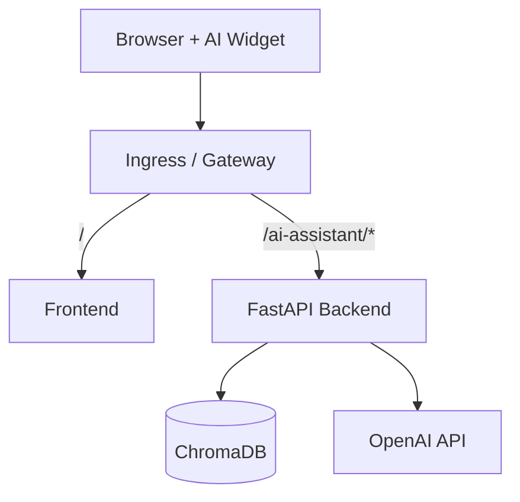
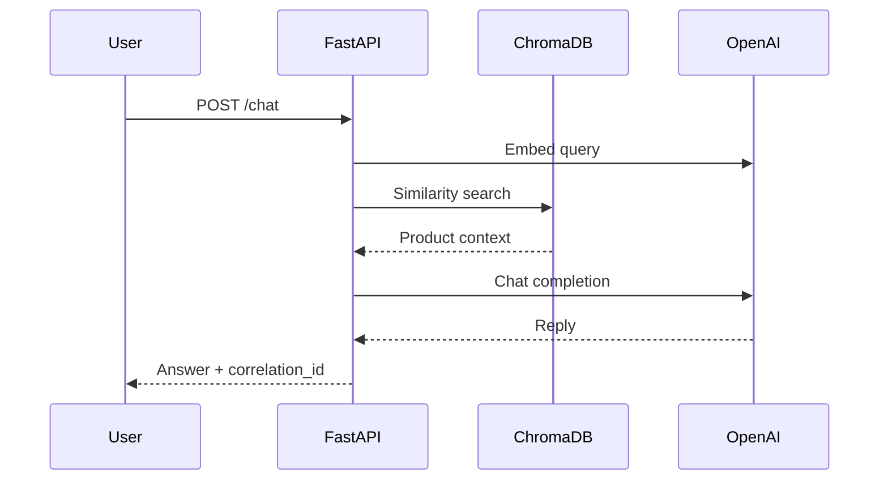

# OWASP Juice Shop Chatbot

Cloud-native **RAG AI chatbot** for [OWASP Juice Shop](https://owasp-juice.shop): Angular chat widget, FastAPI backend, OpenAI, ChromaDB, Docker, Kubernetes, Helm, KIND, ArgoCD GitOps, and GitHub Actions CI/CD.

**Repository:** https://github.com/amaninsa/owasp-juiceshop-chatbot

[](LICENSE)
[](https://github.com/amaninsa/owasp-juiceshop-chatbot/actions/workflows/ai-platform-ci.yml)

---

## Features

- AI chat widget embedded in Juice Shop
- FastAPI RAG backend (retrieve → generate)
- OpenAI embeddings + chat completions
- ChromaDB vector store of Juice Shop products
- Docker Compose (local)
- Production Dockerfiles + healthchecks
- Kubernetes manifests (GitOps Kustomize)
- Helm chart
- KIND local cluster
- ArgoCD Applications (auto-sync / prune / selfHeal)
- GitHub Actions: lint, test, build, Trivy, GHCR push, KIND smoke
- Prometheus `/metrics`, Grafana dashboard
- `/livez`, `/readyz`, `/health`
- Structured JSON logging + correlation IDs
- NetworkPolicies, RBAC, non-root security contexts

---

## Architecture



Full diagram set: [`docs/architecture.md`](./docs/architecture.md)

---

## RAG flow



---

## Tech stack

| Layer | Tech |
|-------|------|
| Frontend | Angular (Juice Shop) + AI widget |
| Backend | Python 3.11, FastAPI, Pydantic |
| AI | OpenAI embeddings + GPT |
| Vector DB | ChromaDB |
| Edge | nginx gateway / ingress-nginx |
| Orchestration | Docker Compose, Kubernetes, Helm, KIND |
| GitOps | ArgoCD + Kustomize |
| CI/CD | GitHub Actions → GHCR |
| Observability | Prometheus, Grafana, JSON logs |

---

## Folder structure

```text
frontend/                 Juice Shop UI + AI chat widget
backend/                  FastAPI RAG assistant
chromadb/                 ChromaDB image
deploy/                   nginx gateway
apps/                     GitOps base + overlays (local/dev/prod/ci)
helm/                     Helm chart
k8s/                      Thin wrapper → apps/overlays/local
argocd/                   ArgoCD Project + Applications
.github/workflows/        ai-platform-ci.yml
scripts/                  kind-up, deploy, validate, …
docs/                     Runbooks + architecture
monitoring/               Grafana dashboard JSON
Makefile                  Local orchestration
docker-compose.yml
kind-config.yaml
```

---

## Prerequisites

- Docker (Desktop or Colima)
- Node.js 24+ (optional local frontend)
- Python 3.11+ (optional local backend)
- `kubectl`, `kind`, `helm`, `make` (Kubernetes path)
- OpenAI API key

```bash
cp .env.example .env.openai
# edit: OPEN_AI_KEY=sk-...
```

---

## Installation

```bash
git clone https://github.com/amaninsa/owasp-juiceshop-chatbot.git
cd owasp-juiceshop-chatbot
cp .env.example .env.openai   # set OPEN_AI_KEY
```

### Docker Compose

```bash
docker compose up --build
```

| URL | Service |
|-----|---------|
| http://localhost:3000 | Gateway (UI + `/ai-assistant`) |
| http://localhost:8000 | Backend direct |
| http://localhost:8001 | ChromaDB |

### KIND

```bash
make kind-up
make deploy
make validate
```

Add hosts entry: `127.0.0.1 juiceshop-chatbot.local`  
Open: http://juiceshop-chatbot.local:8080

### Helm

```bash
make kind-up && make build-images && make load-images
kubectl -n juiceshop-chatbot create secret generic juiceshop-chatbot-secrets \
  --from-literal=OPEN_AI_KEY="sk-..." --dry-run=client -o yaml | kubectl apply -f -
make helm-install
```

Do **not** mix Helm and Kustomize in the same namespace.

### GitOps (ArgoCD)

```bash
kubectl apply -k argocd/
```

Applications point at https://github.com/amaninsa/owasp-juiceshop-chatbot.git  
Details: [`docs/gitops.md`](./docs/gitops.md)

### CI/CD

Workflow: [`.github/workflows/ai-platform-ci.yml`](./.github/workflows/ai-platform-ci.yml)

Lint → test → Helm/Kustomize → build → Trivy → GHCR (`latest` / SHA / semver) → KIND smoke → GitOps tag bump.

Images: `ghcr.io/amaninsa/owasp-juiceshop-chatbot-{frontend,backend,chromadb,gateway}`

---

## Usage

1. Open the shop UI.
2. Use the AI chat widget.
3. Ask about products and prices (answers grounded in Chroma-retrieved catalog context).

API examples:

```bash
curl -s http://localhost:8000/livez
curl -s http://localhost:8000/health
curl -s -X POST http://localhost:8000/chat \
  -H 'Content-Type: application/json' \
  -d '{"message":"What is the price of the Apple Juice?"}'
```

---

## Screenshots

Run the stack locally, then capture the chat widget in the Juice Shop UI.  
Place screenshots under `docs/screenshots/` if you add them later.

---

## Troubleshooting

| Issue | Fix |
|-------|-----|
| Chat 502 | Check `OPEN_AI_KEY` / secret `juiceshop-chatbot-secrets` |
| `/readyz` 503 | ChromaDB pod / PVC |
| Ingress 404 | Host `juiceshop-chatbot.local`, port **8080** |
| Image pull on KIND | `make build-images && make load-images` |
| NetworkPolicy blocks | Confirm `ingress-nginx` ns; CI overlay disables NP |

```bash
make status
make logs-backend
make validate
```

---

## Future improvements

- External Secrets / Sealed Secrets
- HPA + PodDisruptionBudgets
- OpenTelemetry tracing
- Multi-arch (`linux/arm64`) images
- Argo Rollouts
- Cypress e2e for the chat widget
- Optional local LLM (air-gapped)

---

## Documentation

| Doc | Topic |
|-----|-------|
| [docs/architecture.md](./docs/architecture.md) | Mermaid diagrams |
| [docs/kind-deployment.md](./docs/kind-deployment.md) | KIND |
| [docs/helm.md](./docs/helm.md) | Helm |
| [docs/gitops.md](./docs/gitops.md) | ArgoCD |
| [docs/ci-cd.md](./docs/ci-cd.md) | GitHub Actions |
| [docs/observability.md](./docs/observability.md) | Metrics / logs |
| [docs/security.md](./docs/security.md) | Hardening |
| [docs/validation.md](./docs/validation.md) | `make validate` |
| [DELIVERABLES.md](./DELIVERABLES.md) | Delivery checklist |
| [AI-PLATFORM.md](./AI-PLATFORM.md) | Extended platform guide |

---

## License

MIT — see [`LICENSE`](./LICENSE). Includes OWASP Juice Shop (MIT) with AI platform additions.

---

## Author

**amaninsa** — https://github.com/amaninsa

Project: https://github.com/amaninsa/owasp-juiceshop-chatbot

Based on [OWASP Juice Shop](https://github.com/juice-shop/juice-shop).
