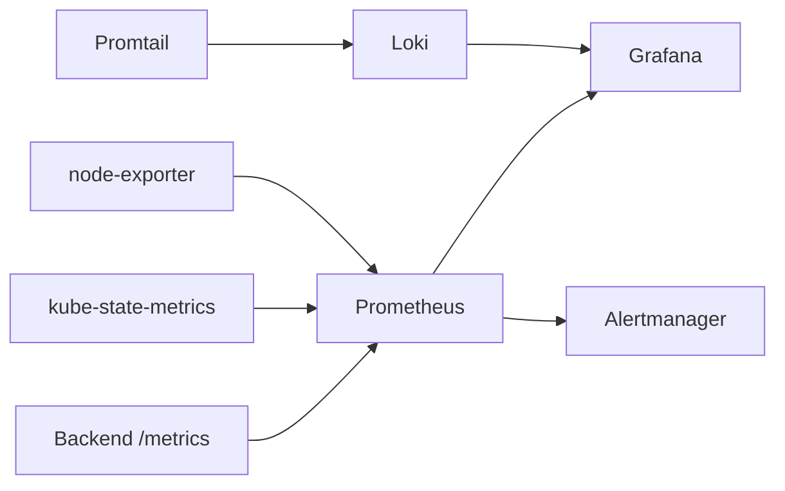

# Monitoring & observability

Production-inspired observability for the Juice Shop AI platform on KIND.  
Stack path: `k8s/monitoring/` · Deploy: `make monitoring`

---

## Profiles

| Profile | Command | Storage | Retention | cAdvisor |
|---------|---------|---------|-----------|----------|
| **local** (default) | `make monitoring` | emptyDir + sizeLimits | Prometheus 24h/512MB, Loki 24h | **Disabled** |
| **production** | `make monitoring-production` | PVC | Prometheus 15d, Loki 7d | Enabled (from base) |

```bash
make doctor
make monitoring
make monitoring-status
make urls
```

---

## Architecture



---

## Prometheus

**Role:** scrape metrics, evaluate alert rules, store TSDB samples.

Local flags (KIND-optimized):

- `--storage.tsdb.retention.time=24h`
- `--storage.tsdb.retention.size=512MB`
- `--query.max-concurrency=4`
- `--query.timeout=30s`
- emptyDir data volume (`sizeLimit` ~768Mi)

UI: http://prometheus.juiceshop-chatbot.local:8080

### Targets

**Status → Targets** should show the backend job UP (annotations + NetworkPolicy allow scrape from `monitoring`).

### Scraping

Sources include:

- FastAPI `/metrics` (`prometheus-client`)
- kube-state-metrics
- node-exporter
- kubelet `/metrics/cadvisor` (API proxy) — used when the privileged cAdvisor DaemonSet is off

### PromQL examples

```promql
up
kube_pod_info{namespace="juiceshop-chatbot"}
rate(container_cpu_usage_seconds_total{namespace="juiceshop-chatbot"}[5m])
```

Use series from your backend instrumentation for HTTP/chat rates (see Grafana AI dashboards).

---

## Grafana

**Role:** dashboards + Explore for metrics and logs.

- Datasources + dashboards provisioned from ConfigMaps (no manual import)
- Local storage: emptyDir (sqlite state is ephemeral — fine for demos)
- Login: `admin` / `admin` (anonymous Viewer enabled)

UI: http://grafana.juiceshop-chatbot.local:8080

### Dashboards

Cluster overview, namespace/pod/deployment/node/container, backend FastAPI, ChromaDB, AI assistant, application logs.

---

## Loki

**Role:** log aggregation (filesystem store).

Local config highlights:

- `retention_period: 24h`
- Compactor with `retention_enabled: true` (deletes old chunks)
- Reduced ingestion rate + smaller WAL for KIND disk
- emptyDir `sizeLimit` ~512Mi

Loki is **not** exposed on Ingress. Use Grafana Explore or:

```bash
make monitoring-port-forward
# Loki → localhost:3100
```

---

## Promtail

**Role:** ship pod logs to Loki.

- Positions file on emptyDir (`sync_period: 30s` to reduce writes)
- Scrapes `juiceshop-chatbot` + `ingress-nginx` (drops noisy monitoring self-logs)

---

## Alertmanager

**Role:** receive firing alerts from Prometheus; group and display locally.

UI: http://alertmanager.juiceshop-chatbot.local:8080  
Rules: `k8s/monitoring/base/alerts/rules.yaml`

---

## Node exporter

**Role:** host-level CPU, memory, filesystem, load metrics from the KIND node.  
Runs as a DaemonSet (single node locally).

---

## kube-state-metrics

**Role:** Kubernetes object metrics (Deployments, Pods, PVCs, Nodes, …) for Grafana cluster dashboards and alerts like PVCAlmostFull / PodCrashLoopBackOff.

---

## Why cAdvisor is disabled in the local profile

The privileged **cAdvisor DaemonSet** is removed in `k8s/monitoring/local` because:

1. **Disk & CPU** — it is one of the heaviest agents on Apple Silicon KIND and contributed to container-storage pressure alongside Prometheus/Loki.
2. **Overlap** — kubelet already exposes `/metrics/cadvisor`; Prometheus still scrapes that path for container metrics.
3. **Demo focus** — node-exporter + kube-state-metrics + app `/metrics` cover interview talking points without the extra DaemonSet.
4. **Production profile** — `k8s/monitoring/production` keeps cAdvisor from `base` when you want the full agent on a larger cluster.

---

## Expected local resources

| Area | Target |
|------|--------|
| Host RAM (app + monitoring + Argo CD) | ~6–10 GiB |
| KIND free disk | ≥ 5–8 GiB |
| Monitoring profile | local / emptyDir |

If DiskPressure appears: `make clean` then `make doctor`.

---

## Troubleshooting

| Symptom | Fix |
|---------|-----|
| Targets DOWN | Backend Ready? NetworkPolicy? `make monitoring-status` |
| Grafana empty | ConfigMaps mounted? `kubectl -n monitoring get cm` |
| No logs | Promtail Running? Namespace keep regex |
| OOM / disk full | `make clean`; confirm local profile (not production PVC on tiny disk) |

More: [`troubleshooting.md`](./troubleshooting.md)
