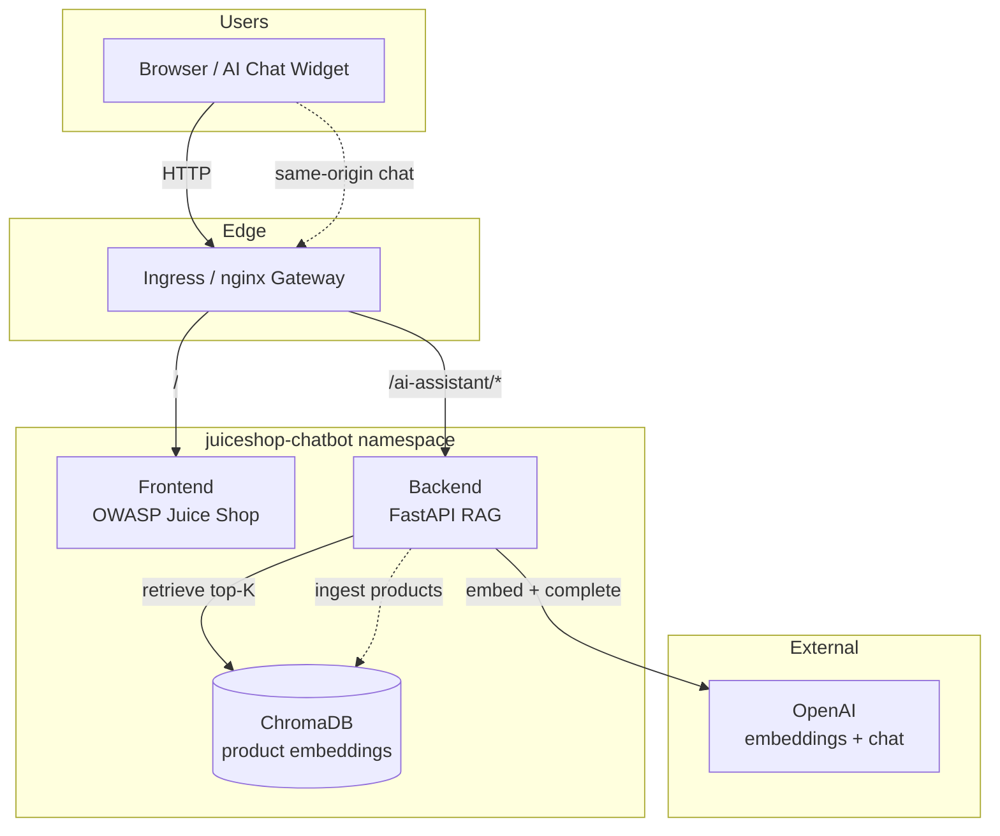
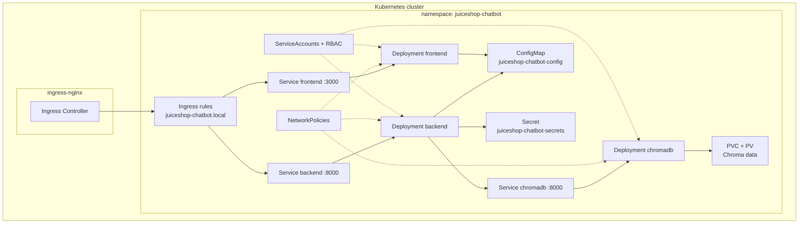
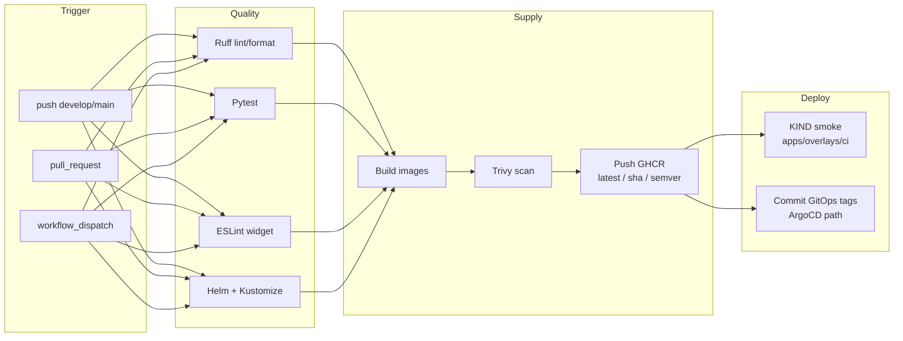
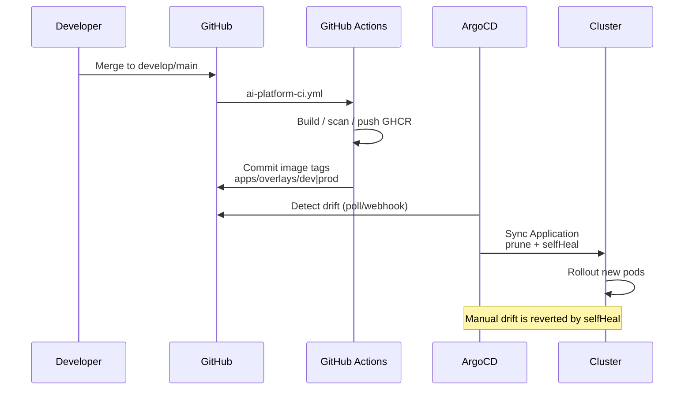
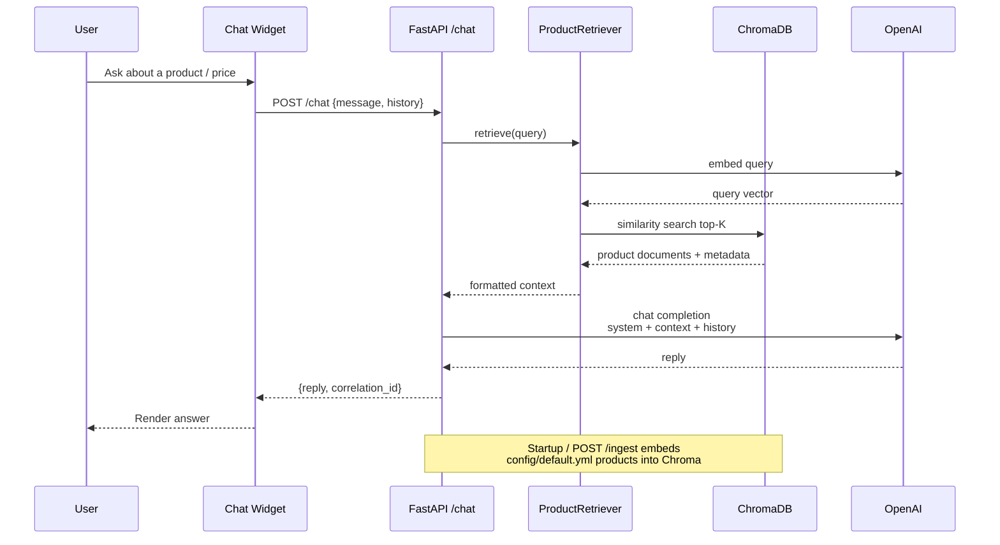
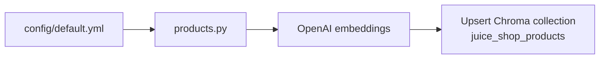

# Architecture diagrams

Mermaid diagrams for the Juice Shop AI platform. Rendered in GitHub, most IDEs, and [mermaid.live](https://mermaid.live).

Also summarized in [`AI-PLATFORM.md`](../AI-PLATFORM.md).

---

## 1. Overall architecture

End-to-end request and data flow across client, edge, workloads, and OpenAI.

---

## 2. Kubernetes architecture

Workloads, storage, config, and traffic inside the cluster (KIND / cloud).

---

## 3. GitHub Actions flow

CI/CD pipeline for the AI platform (`.github/workflows/ai-platform-ci.yml`).

---

## 4. GitOps flow

Desired state in Git; ArgoCD reconciles the cluster.

**Overlays**

| Path | Audience |
|------|----------|
| `apps/overlays/local` | KIND laptop |
| `apps/overlays/dev` | Shared/dev cluster |
| `apps/overlays/prod` | Production |
| `apps/overlays/ci` | Ephemeral CI KIND |

---

## 5. RAG flow

Product Q&A: retrieve relevant Juice Shop products, then generate an answer.

**Ingest (offline / startup)**

---

## How to edit

1. Change the Mermaid source in this file.
2. Preview on GitHub or paste into [mermaid.live](https://mermaid.live).
3. Keep diagrams aligned with `apps/base`, `backend/`, and `AI-PLATFORM.md`.
