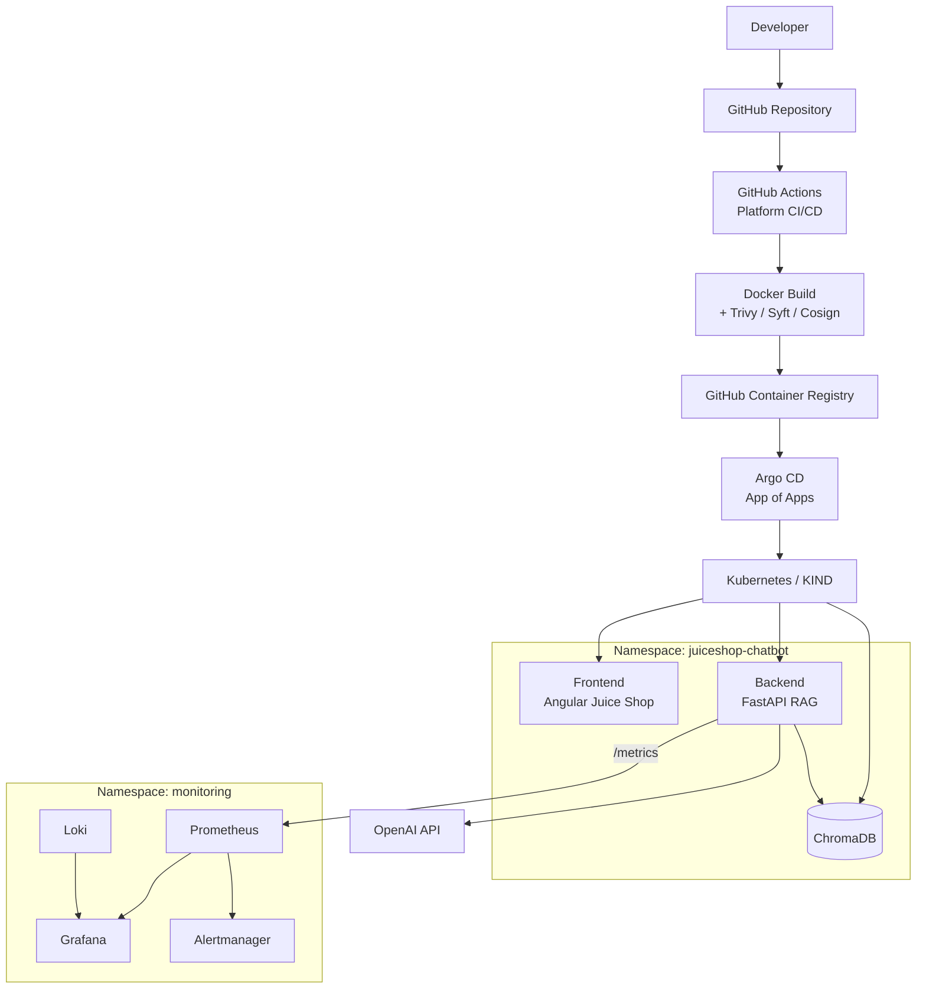
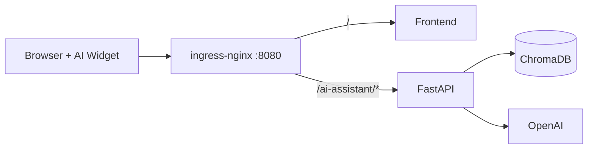
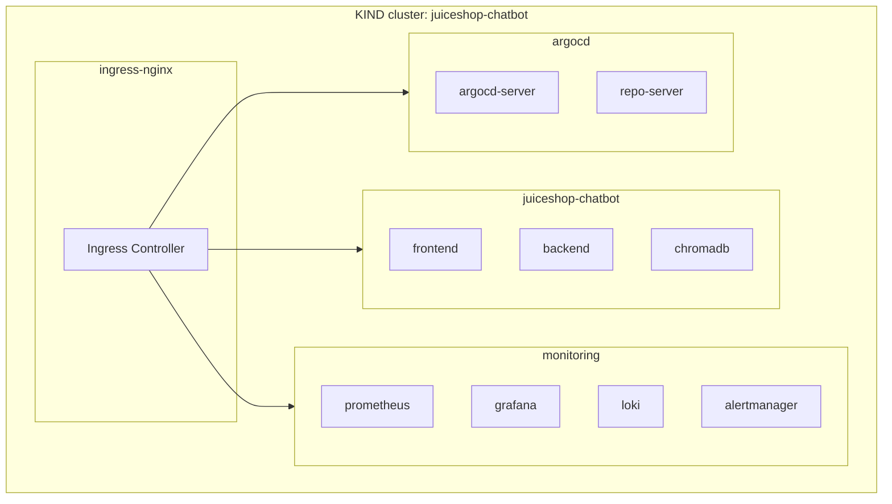
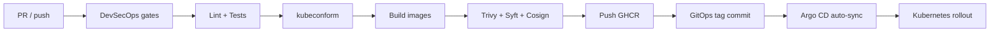
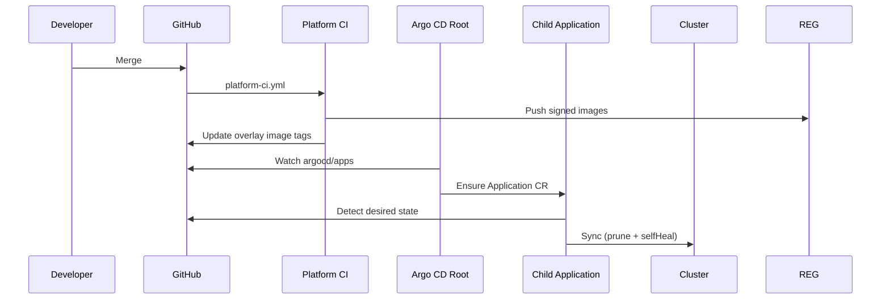
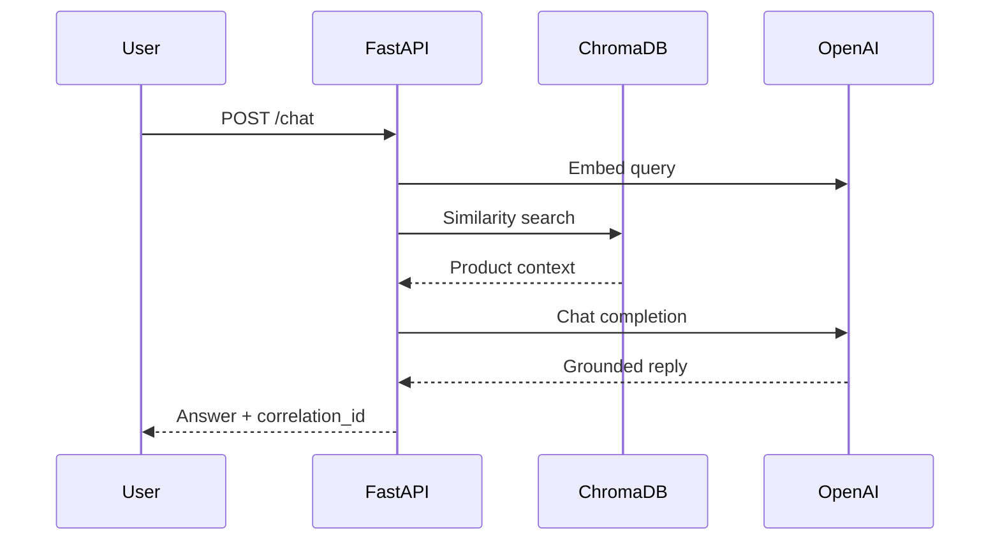
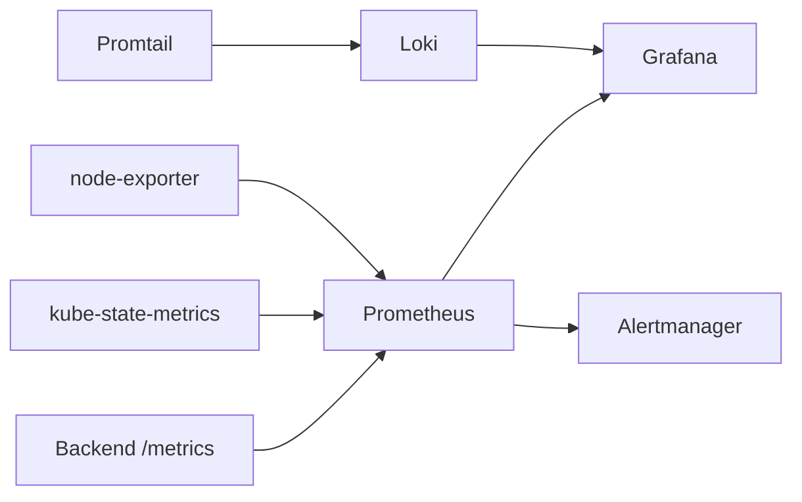

# Architecture — Juice Shop AI Cloud Native Platform

Production-inspired platform architecture for a RAG chatbot on Kubernetes.
Diagrams are Mermaid (GitHub-native). Export PNG from [mermaid.live](https://mermaid.live) or the sources under [`docs/diagrams/`](./diagrams/).

---

## 1. End-to-end platform (CI → GitOps → runtime → observability)

Source: [`diagrams/platform-overview.mmd`](./diagrams/platform-overview.mmd)

---

## 2. Request path (user → AI)

---

## 3. Kubernetes layout

---

## 4. GitHub Actions → GHCR → Argo CD

Details: [`github-actions.md`](./github-actions.md) · [`cicd.md`](./cicd.md)

---

## 5. GitOps (App of Apps)

Details: [`argocd.md`](./argocd.md) · [`gitops.md`](./gitops.md)

---

## 6. RAG sequence

---

## 7. Observability data flow

Local profile notes: emptyDir + 24h retention; **cAdvisor DaemonSet disabled** (see [`monitoring.md`](./monitoring.md)).

---

## Overlays / namespaces

| Path | Namespace | Audience |
|------|-----------|----------|
| `apps/overlays/local` | `juiceshop-chatbot` | KIND laptop |
| `apps/overlays/dev` | `juiceshop-chatbot-dev` | Shared / staging |
| `apps/overlays/prod` | `juiceshop-chatbot-prod` | Production-style |
| `k8s/monitoring/local` | `monitoring` | KIND observability |
| `k8s/monitoring/production` | `monitoring` | PVC + longer retention |

---

## Export PNG

1. Open [`diagrams/platform-overview.mmd`](./diagrams/platform-overview.mmd) in [mermaid.live](https://mermaid.live).
2. **Actions → PNG / SVG**.
3. Save under `docs/screenshots/` for LinkedIn (see [`screenshots.md`](./screenshots.md)).
