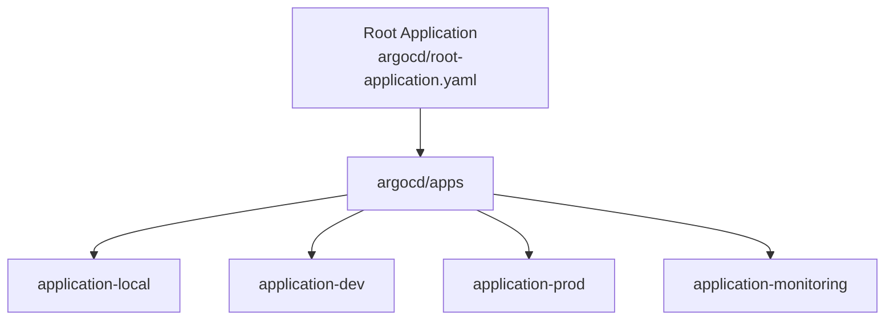

# Argo CD — GitOps for this platform

How Argo CD is used in this repository. Install path: `make argocd-install` → `make argocd-apply`.  
Related: [`gitops.md`](./gitops.md) · [`argocd/README.md`](../argocd/README.md)

UI: http://argocd.juiceshop-chatbot.local:8080  
Login: `admin` / `make argocd-password`

---

## Mental model

```text
Git (desired state)
  → Argo CD Application CR
  → Kubernetes Live state
```

If Git and the cluster disagree, **self-heal** brings the cluster back to Git.

---

## Application

An **Application** is an Argo CD custom resource that points at:

| Field | Example in this repo |
|-------|----------------------|
| `repoURL` | `https://github.com/amaninsa/owasp-juiceshop-chatbot.git` |
| `path` | `apps/overlays/local` or `k8s/monitoring/local` |
| `destination.namespace` | `juiceshop-chatbot` / `monitoring` |
| `syncPolicy` | automated + prune + selfHeal |

Child apps live under `argocd/apps/`.

---

## App of Apps



The **root** Application only manages other Application manifests.  
Each child Application manages real workloads. This scales cleanly to many environments.

---

## Sync

**Sync** = apply Git revision to the cluster.

- Manual: Sync button in UI  
- Automated: `syncPolicy.automated` (used here)  
- Options: Server-Side Apply, CreateNamespace, prune last  

```bash
kubectl -n argocd get applications
# or use the UI Sync / Refresh
```

---

## Health

Argo reports health from Kubernetes conditions (Deployments Ready, etc.):

| Status | Meaning |
|--------|---------|
| Healthy | Workloads Ready |
| Progressing | Rollout in progress |
| Degraded | Something failed |
| Missing | Expected object absent |
| Suspended | Paused / suspended resource |

---

## Tree view

UI **Tree** shows every managed object (Deployments, Services, Ingress, ConfigMaps, …) and parent/child relationships. Useful in demos to prove GitOps ownership.

---

## GitOps principles (as implemented)

1. **Declarative** — manifests in Git (`apps/`, `k8s/monitoring/`)  
2. **Versioned** — every change is a commit  
3. **Pulled** — Argo pulls; CI does not push live apply to prod-style envs  
4. **Continuous** — auto-sync closes the loop  

---

## Self heal

`selfHeal: true` — if someone `kubectl edit`s a live object, Argo reverts to Git.  
Demo idea: change a replica count manually, watch Argo restore it.

---

## Auto sync

`automated: {}` (with prune/selfHeal) keeps the cluster matching `targetRevision` (usually `HEAD`).

---

## Prune

`prune: true` — objects removed from Git are deleted from the cluster on sync. Prevents orphan resources.

---

## Retry

Sync failures use exponential backoff (`syncPolicy.retry` in Application specs). Transient API errors do not leave the app permanently OutOfSync without retries.

---

## History

UI **History** lists sync revisions. Pick a previous Git SHA to understand what changed.

---

## Events

Application **Events** explain sync errors (permission, validation, image pull). First place to look when Health is Degraded.

---

## Rollback

1. Open Application → History  
2. Select a known-good sync  
3. Sync / rollback to that revision  

Prefer fixing forward in Git for production; rollback is the emergency lever.

---

## Local KIND notes

`make argocd-install` applies:

- Stable upstream install (server-side apply for large CRDs)  
- Ingress for `argocd.juiceshop-chatbot.local`  
- Repo-server emptyDir sizeLimits + lower memory (Apple Silicon friendly)  

GitOps behaviour stays identical; only resource pressure is reduced.

---

## Demo checklist

- [ ] Root app Synced / Healthy  
- [ ] Child apps Synced  
- [ ] Tree shows frontend / backend / chromadb  
- [ ] Mention auto-sync + self-heal + prune  
- [ ] Tie to GitHub Actions tag commit  
