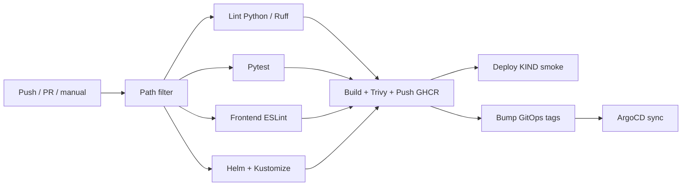

# CI/CD — GitHub Actions (AI Platform)

Workflow: [`.github/workflows/ai-platform-ci.yml`](../.github/workflows/ai-platform-ci.yml)

## Pipeline stages



| Stage | What it does |
|-------|----------------|
| **Lint** | `ruff check` + `ruff format --check` on `backend/` |
| **Tests** | `pytest` with coverage |
| **Frontend** | ESLint on AI widget + assistant service |
| **Manifests** | `helm lint` / `helm template` + `kubectl kustomize` overlays |
| **Build** | Multi-image matrix → GHCR (`latest`, short SHA, semver on `main`/`v*`) |
| **Scan** | Trivy (CRITICAL/HIGH, non-blocking exit) |
| **Deploy KIND** | Ephemeral KIND + `apps/overlays/ci` + `/livez` smoke |
| **GitOps** | Commits tag bumps for ArgoCD (`dev` SHA, `prod` version when set) |

## Image tags

| Tag | When |
|-----|------|
| `latest` | Every successful push/manual build |
| `<12-char-sha>` | Every successful push/manual build |
| `<package.json version>` | Pushes to `main` |
| `vX.Y.Z` | Git tag pushes matching `v*` |

Registry: `ghcr.io/amaninsa/owasp-juiceshop-chatbot-{frontend,backend,chromadb,gateway}`

## Required secrets

| Secret | Purpose |
|--------|---------|
| `OPEN_AI_KEY` | KIND smoke deploy (optional; placeholder used if missing) |
| `GITHUB_TOKEN` | Provided by Actions (packages + GitOps commits) |

## Local equivalents

```bash
# Python
cd backend && pip install -r requirements-dev.txt
ruff check . && ruff format --check .
OPEN_AI_KEY=test-key PRODUCTS_CONFIG_PATH=../config/default.yml pytest

# Manifests
make helm-lint
kubectl kustomize apps/overlays/ci

# Image tag bump (dry-run style)
OWNER=myorg ./scripts/update-image-tags.sh abcdef123456
```

Or via Make:

```bash
make ci-lint
make ci-test
```

## Manual run

Actions → **AI Platform CI/CD** → **Run workflow**

- `deploy_kind` (default true): ephemeral KIND after push images
- `deploy_argocd` is informational; tag bumps run automatically on push to `develop`/`main`

## Notes

- PRs run lint/test/manifest checks only (no push to GHCR).
- Use **either** Helm **or** Kustomize/ArgoCD in a namespace — resource names differ.
- Local KIND demos continue to use `kind-config.yaml` + `apps/overlays/local`.
- CI KIND uses `kind-config.ci.yaml` + `apps/overlays/ci` (no hostPath PV).
