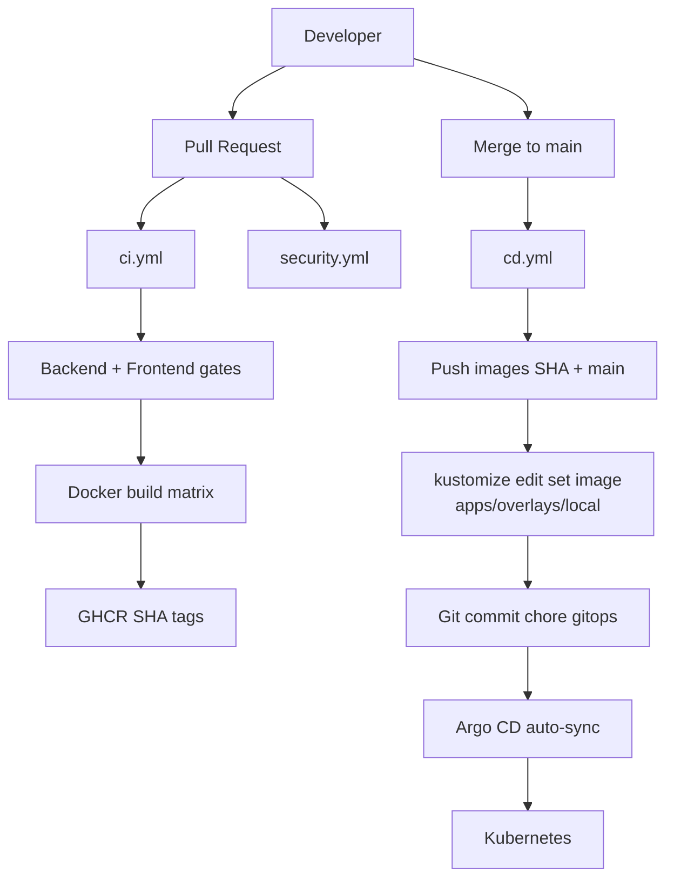

# GitHub Actions — Enterprise CI/CD (GitOps)

Primary workflows:

| File | Role |
|------|------|
| [`.github/workflows/ci.yml`](../.github/workflows/ci.yml) | PR quality + GHCR SHA publish |
| [`.github/workflows/cd.yml`](../.github/workflows/cd.yml) | Main → images → Kustomize → Git → Argo CD |
| [`.github/workflows/security.yml`](../.github/workflows/security.yml) | Gitleaks, Trivy, Dependency Review, CodeQL |
| [`.github/workflows/release.yml`](../.github/workflows/release.yml) | Tag `v*` → notes + images + GitHub Release |
| [`.github/workflows/reusable-build-images.yml`](../.github/workflows/reusable-build-images.yml) | Shared build/scan/push matrix |

Composite actions: `.github/actions/{setup-python-backend,setup-node-frontend,docker-build-push}/`

---

## Deployment flow (no kubectl from CI)



---

## CI (`ci.yml`) — every Pull Request

### Backend

- Black `--check`
- isort `--check-only`
- Ruff lint + format check
- mypy
- pytest

### Frontend

- `npm ci` when lockfiles exist (else `npm install` with notice)
- `npm run lint`
- `npm run build`

### Containers

After quality gates pass, reusable workflow builds and pushes:

```text
ghcr.io/<owner>/frontend:<PR_HEAD_SHA>
ghcr.io/<owner>/backend:<PR_HEAD_SHA>
ghcr.io/<owner>/chromadb:<PR_HEAD_SHA>
```

Each image is Trivy-scanned (**fail** CRITICAL/HIGH) before push.

CI **does not** mutate GitOps manifests and **does not** call `kubectl apply`.

---

## CD (`cd.yml`) — merge to `main`

1. Build & push images tagged with `$GITHUB_SHA` (+ `main`)
2. `kustomize edit set image` via [`scripts/gitops-set-images.sh`](../scripts/gitops-set-images.sh) on `apps/overlays/local`
3. Commit + push with `chore(gitops): … [skip ci]`
4. Argo CD Application for local overlay detects the commit and syncs

Loop prevention: commits containing `[skip ci]` / `chore(gitops)` skip CD.

---

## Security (`security.yml`)

| Job | When |
|-----|------|
| Gitleaks | PR, push, schedule |
| Trivy filesystem + SARIF | PR, push, schedule |
| Trivy config (IaC) | PR, push, schedule |
| Dependency Review | PR only |
| CodeQL (`javascript-typescript`, `python`) | PR, push, schedule |

Permissions (workflow-level):

```yaml
permissions:
  contents: read
  packages: write
  id-token: write
  security-events: write
```

CD elevates `contents: write` only for the GitOps commit (still uses `GITHUB_TOKEN`, no PAT).

---

## Release (`release.yml`) — tags `v*`

1. Resolve version from tag
2. Build/push images with tags `$SHA` and `$VERSION`
3. Generate release notes (GitHub API)
4. Publish GitHub Release listing GHCR image refs

---

## Caching & reuse

- Pip cache via `setup-python` (`requirements*.txt`)
- npm cache via `setup-node`
- Docker layer cache (`type=gha`) scoped per image
- Matrix build for frontend / backend / chromadb (`fail-fast: true`)
- Concurrency groups cancel stale PR runs

---

## Local helpers

```bash
# Preview GitOps image bump (requires kustomize)
TAG=$(git rev-parse HEAD) OWNER=amaninsa ./scripts/gitops-set-images.sh

make ci-lint
make ci-test
```

## GHCR visibility (KIND / Argo CD)

For Argo CD on KIND to pull `ghcr.io/<owner>/{frontend,backend,chromadb}` without an `imagePullSecret`, set the GHCR packages to **Public** (or configure a pull secret in the `juiceshop-chatbot` namespace). CI/CD itself authenticates to GHCR with `GITHUB_TOKEN` for **push** only.
