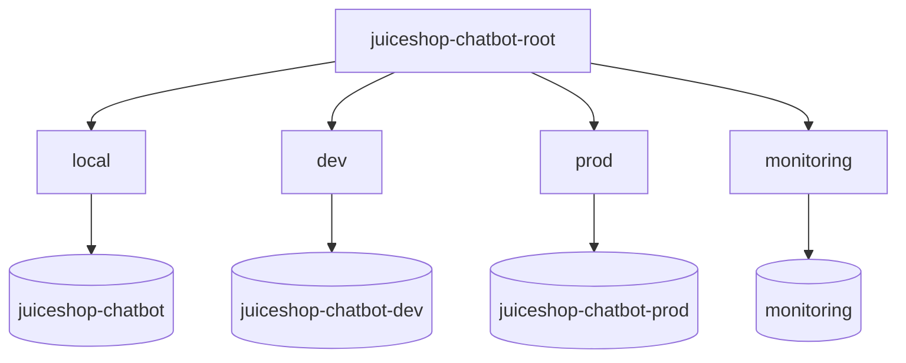

# GitOps Workflow (ArgoCD App of Apps)

Canonical delivery: **Git → ArgoCD → Kubernetes**.  
UI concepts (Sync, Health, Tree, Self Heal, Rollback): **[argocd.md](./argocd.md)**  
Kustomize under `apps/` is the source of truth. Helm is an alternate packaging path (do not mix in one namespace).

## Why `make argocd-apply` failed before

Argo CD custom resources (`Application`, `AppProject`) require CRDs from the Argo CD install.

| Step | Command | What it does |
|------|---------|--------------|
| 1 | `make kind-up` | KIND + ingress-nginx |
| 2 | `make argocd-install` | Installs Argo CD **including CRDs**, waits, exposes UI |
| 3 | `make argocd-apply` | Applies AppProject + App-of-Apps root |

Without step 2 you get:

```text
no matches for kind Application in version argoproj.io/v1alpha1
```

## App of Apps layout

```text
argocd/
  project.yaml              # AppProject
  root-application.yaml     # App of Apps entrypoint
  ingress.yaml              # UI via nginx (argocd.juiceshop-chatbot.local)
  kustomization.yaml        # bootstrap: project + root
  apps/
    application-local.yaml
    application-dev.yaml
    application-prod.yaml
    application-monitoring.yaml
apps/overlays/{local,dev,prod,ci}
```



## Sync policy

All Applications enable:

- Automated sync
- `prune: true`
- `selfHeal: true`
- `CreateNamespace=true`
- `ServerSideApply=true`
- Retry with exponential backoff

Health checks use native Kubernetes readiness (Deployments / DaemonSets).

## Bootstrap (KIND)

```bash
make kind-up
make argocd-install          # CRDs + server + ingress + prints admin password
make argocd-apply            # AppProject + root Application

# Optional helpers
make argocd-password
make argocd-status
make argocd-ui               # localhost:8081
```

Hosts file:

```text
127.0.0.1 argocd.juiceshop-chatbot.local
```

UI: http://argocd.juiceshop-chatbot.local:8080 (`admin` / `make argocd-password`)

## Environment mapping

| App | Git revision | Overlay | Namespace |
|-----|--------------|---------|-----------|
| local | `HEAD` | `apps/overlays/local` | `juiceshop-chatbot` |
| dev | `develop` | `apps/overlays/dev` | `juiceshop-chatbot-dev` |
| prod | `main` | `apps/overlays/prod` | `juiceshop-chatbot-prod` |
| monitoring | `HEAD` | `k8s/monitoring/local` | `monitoring` |

## CI → GitOps (no kubectl apply for CD)

1. Platform CI builds, scans, signs, pushes GHCR.
2. CI commits image tag bumps to overlays.
3. ArgoCD detects Git change and syncs automatically.

## Secrets (never in Git)

```bash
kubectl -n juiceshop-chatbot create secret generic juiceshop-chatbot-secrets \
  --from-literal=OPEN_AI_KEY="sk-..." \
  --dry-run=client -o yaml | kubectl apply -f -
```

## EKS portability

1. Register EKS as an ArgoCD cluster destination.
2. Update `destination.server` on child Applications (or ApplicationSets).
3. Swap StorageClass to your CSI (`gp3`, etc.).
4. Keep CI unchanged — it only commits Git; Argo deploys.

## Validate without a cluster

```bash
kubectl kustomize argocd
kubectl kustomize argocd/apps
kubectl kustomize apps/overlays/dev
```
